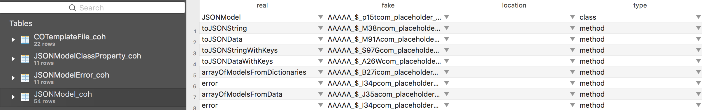

# code-obfuscation

A code obfuscation tool for iOS.

# Pre-setting

- Copy the directory [Obfuscation-Objective-C File.xctemplate](Obfuscation-Objective-C%20File.xctemplate) to `/Applications/Xcode.app/Contents/Developer/Platforms/iPhoneOS.platform/Developer/Library/Xcode/Templates/File Templates/Source`, like below order:

  ```sh
  sudo cp -r Obfuscation-Objective-C\ File.xctemplate/ /Applications/Xcode.app/Contents/Developer/Platforms/iPhoneOS.platform/Developer/Library/Xcode/Templates/File\ Templates/Source
  ```

  Now, you can create obfuscation files in your projects. You might try to create them in your project, and then you will get 3 files.

- Copy the file [CO-Features.h](CodeObfuscation/CodeObfuscation/TemplateFiles/CO-Features.h) to your project if you need the blow macro **Features**.

# How to Use

Execute the order `./CodeObfuscation-release` or `./CodeObfuscation-debug` at your root path of your project.

> Also set the shell script at you Xcode project to exectue it. Also see **Features**.

You could copy the program [CodeObfuscation-release](Products/iOS/CodeObfuscation-release) or [CodeObfuscation-debug](Products/iOS/CodeObfuscation-debug). Both are iOS platform.

# Obfuscation Syntax

- Add macro **`CO_CONFUSION_CLASS`** after keyword **`@interface`** and before classname. It tags the class is added to obfuscation task. e.g.

  ```objective-c
  @interface CO_CONFUSION_CLASS COTemplateFile : NSObject
  @end
  ```

- Also modify the category by **`CO_CONFUSION_CATEGORY`**. And the macro **`CO_CONFUSION_CATEGORY`** must be before category-name at bracket e.g.

  ```objective-c
  @interface NSString (CO_CONFUSION_CATEGORY abcde)
  @end
  ```

- Add macro **`CO_CONFUSION_PROPERTY`** before a property-name declared. It tags the property is added to obfuscation task. e.g.

  ```objective-c
  @interface CO_CONFUSION_CLASS COTemplateFile : NSObject

  @property (nonatomic, strong) NSString * CO_CONFUSION_PROPERTY prop1;
  @property CGFloat CO_CONFUSION_PROPERTY prop2;

  @end
  ```

  ​

- Add macro **`CO_CONFUSION_METHOD`** before a method head of declare or implementation. It tags the method is added to obfuscation task. e.g.

  ```objective-c
  // .h
  @interface CO_CONFUSION_CLASS COTemplateFile : NSObject

  CO_CONFUSION_METHOD
  - (void)makeFoo:(NSString *)foo1 arg2:(NSInteger)arg2;

  CO_CONFUSION_METHOD
  - (instancetype)initWithArg1:(CGFloat)arg, ...;

  @end

  // .m or .mm
  @implementation COTemplateFile

  CO_CONFUSION_METHOD
  - (void)_private:(NSString *)arg1 method:(float)arg2 scanned:(BOOL)scanned
  {
      ;
  }

  @end
  ```

# Features

- Support command. 

  | Subcommand or Options                | Description                              |
  | ------------------------------------ | ---------------------------------------- |
  | **-id \<path>**                      | The directory of info.plist. Default is current executed path. |
  | **-offset \<unsigned integer>**      | The offset of obfuscation. Default is 0. |
  | -release \| -debug                   | It controls the macro `!defined(DEBUG)`. If release, the macro will be used. Default is release, and I suggest that you'd better use release model. (<span style="background:red">deprecated</span>) |
  | **-db \<path>**                      | The directory of obfuscation database. Default is current executed path. |
  | **-root \<path>**                    | The directory of project file or what you want to start. Default is current executed path. |
  | **-super [--strict=\<true\|false>]** | Check the user-class' names which have been entranced obfuscation whethere their super classes exist or not. If exists, will info a warning. For **strict** option, will check all of classes of iOS Kits. |
  | **-st=\<true\|false>**               | Strengthen the obfuscation. Default is true. |
  | **-help**                            | Get the command (maybe, escaping…)) helpful info. |
  | **-version**                         | Get the program supported iOS SDK version. |

- Output `origin-name: obfuscation` map into database. Its structure like:

  

  Use the SQL to search real name:

  ```sql lite
  SELECT real
  FROM JSONModelClassProperty_coh
  WHERE fake = 'f59e'
  	AND type = 'property'
  -- Output: isOptional
  ```

- Use the macro **`CO_NAME`** to obtain the class name on runtime if the class name has been obfused. The 'CO_NAME' always return correct name even If the class name has not been obfused.

- Use the macro **`CO_PROPERTY_SET`** or **`CO_PROPERTY_SET_TYPE`** to help your write setter of property which is added to obfuscation task. e.g.

  ```objective-c
  // Assume there is a NSString property named fullpath at Foo class.
  CO_PROPERTY_SET(fullpath, Fullpath, Foo)
  {
    // Use macro _ or CO_VAR_NAME get the synthesis variable.
    if (![_(fullpath) isEqualToString:fullpath]) {
  	_(fullpath) = fulpath;
  	// TODO other things... 
    }
  }

  // If you want not to use class name
  CO_PROPERTY_SET_TYPE(fullpath, Fullpath, NSString*)
  {
    // Some codes...
  }
  ```

- Use **`CO_PROPERTY_GET`** to synthesis getter method.

- Use **`CO_VAR_NAME`** to obtain synthsis variable. It looks like a little long, you can use **`_`** to do if available.


# Notice

- `CO_CONFUSION_CLASS` and `CO_CONFUSION_CATEGORY` is a prerequisite for `CO_CONFUSION_PROPERTY` and `CO_CONFUSION_METHOD`.
- **COULD NOT** use the code-obfuscation if your code contains runtime code. Unless you control it.

# License

The MIT License.

# TODO:

- Support @protocol.
- Class and Method query command.
